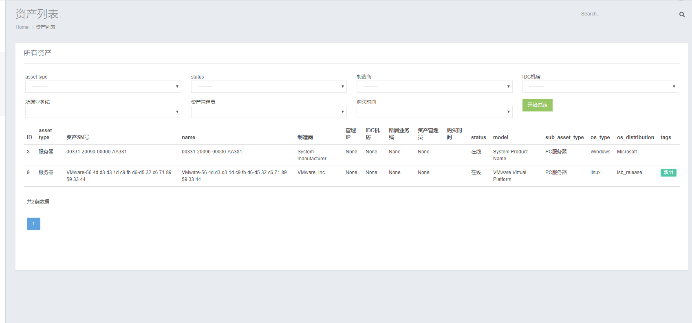
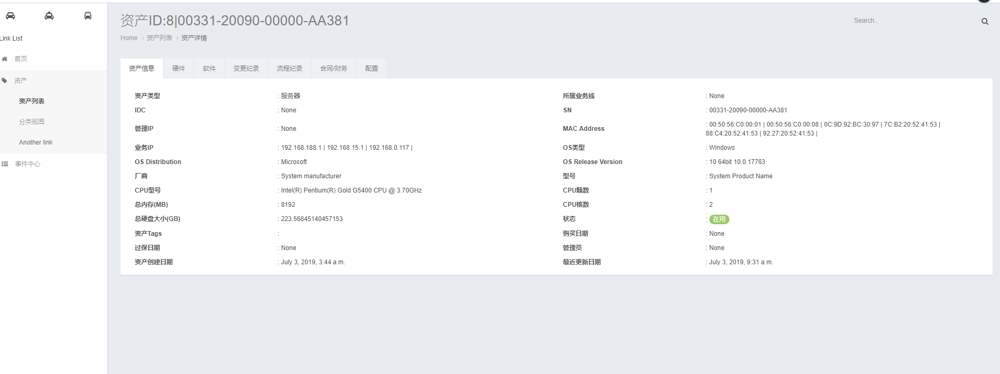

#IT资产管理系统
###开发环境
    开发工具:Pycharm
    存储：Mysql Redis
    服务器:Linux+Nginx+Uwsgi
    后端：Python3 + Django + Django REST framework
    前端：HTML5、CSS3、JavaScript、jQuery、BootStrap
###背景介绍
    由于公司所使用的各种硬件软件等设备较多,管理起来经常出现混乱的情况。
    为了能够快速定位某一资产的信息因此需要一个统一的资产管理平台从而帮助企业全面掌握资产的分布以及运行状况达到降低成本和提高运营效率的目的

###功能描述
1.实现硬件设备信息的采集，并将采集到的信息通过API的形式提交给服务器端

2.采集到的数据提交至服务前端后先将数据存入一张临时表中,通过管理人员审批后正式录入系统

3.以图表的形式查看设备的状态,比如有哪些设备是线上哪些设备是备份,以及设备分布在IDC的情况和所在业务线等信息

4.通过Django-Admin实现对数据的手动管理

5.实现对数据查询/搜索功能,多维度的定位到想匹配的资产

6.将每次资产变更记录至日志中

### 界面展示
 资产列表

资产详情

